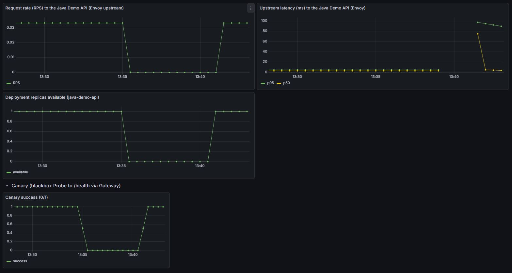
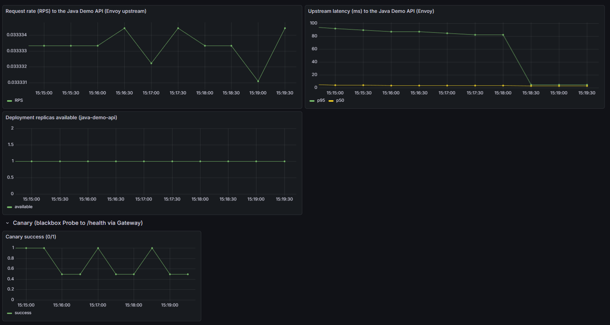
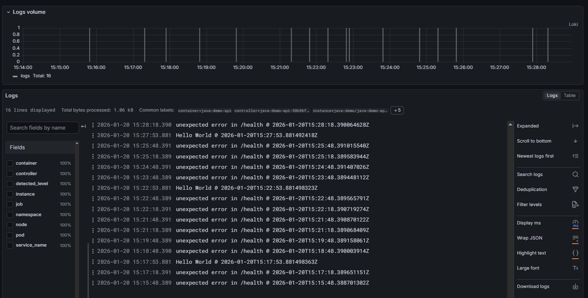
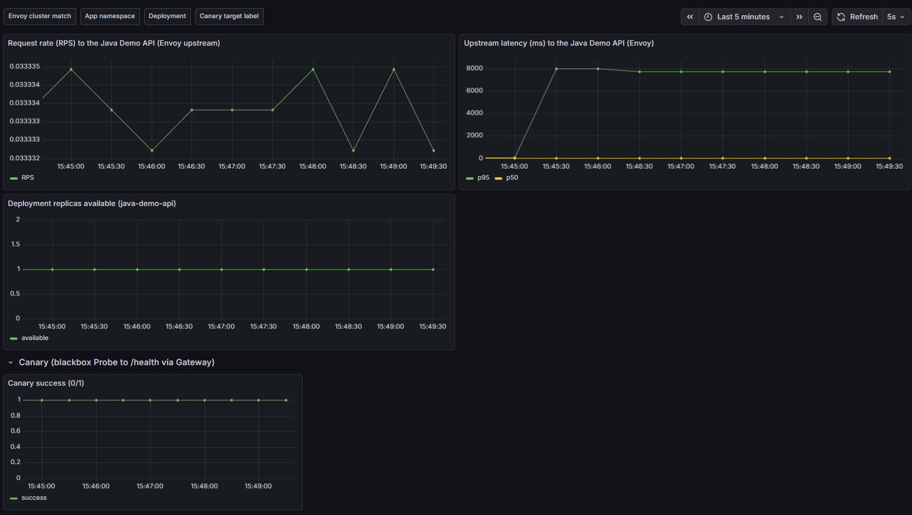
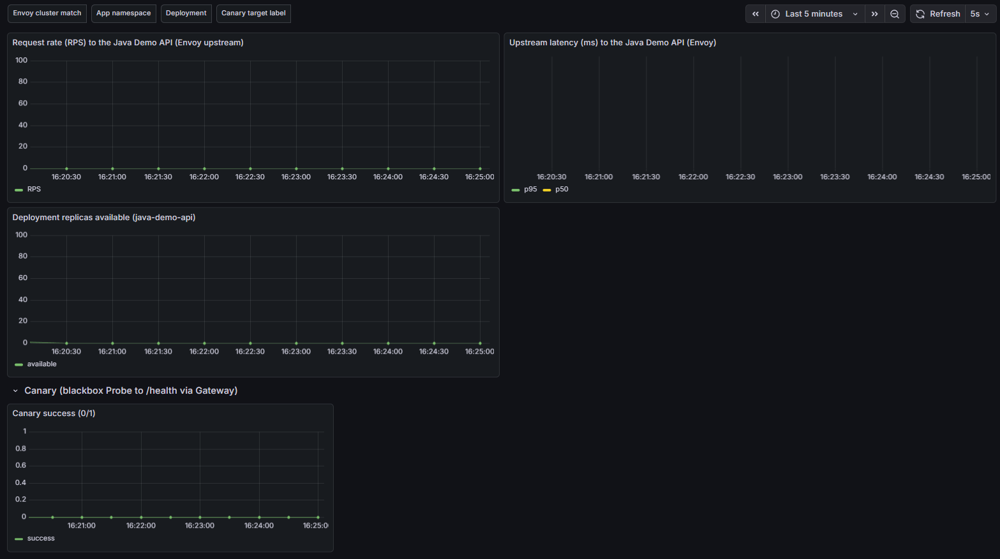
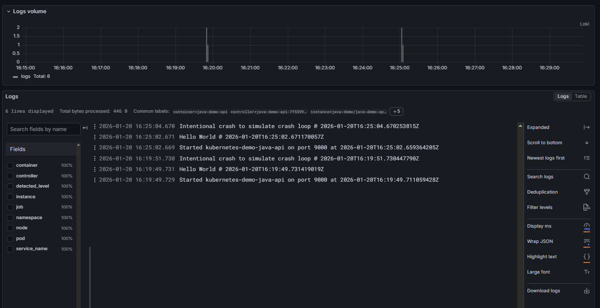
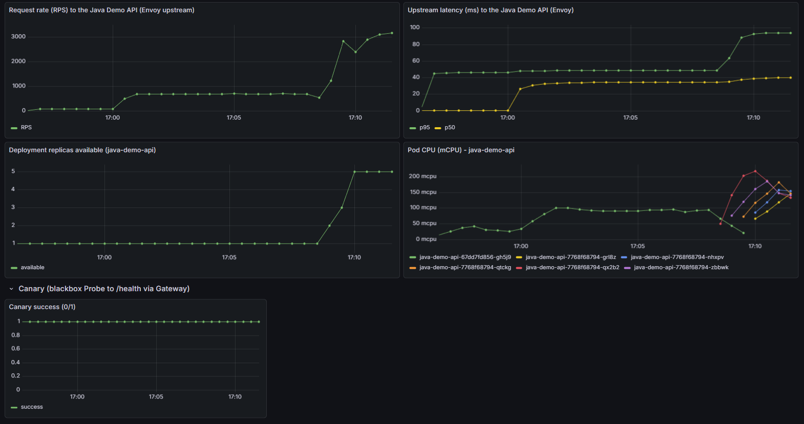
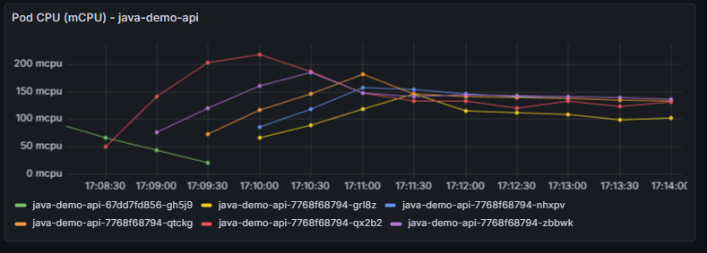
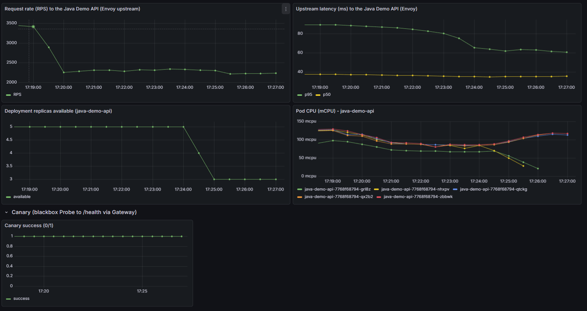

# Table of Contents
- [Scenarios](#scenarios)
  - [Pod failure](#pod-failure)
  - [Degraded service](#degraded-service)
  - [Degraded p95](#degraded-p95)
  - [Crash loop](#crash-loop)
  - [Horizontal Pod Autoscaler](#horizontal-pod-autoscaling)
- [Manual setup steps](#manual-setup-steps)
  - [Setting up a k3s cluster](#setting-up-a-k3s-cluster)
  - [Setting up Add-ons](#setting-up-add-ons)
  - [Setting up Gateway](#setting-up-gateway)
  - [Setting up Flux](#setting-up-flux)
- [Flux managed operations](#flux-managed-operations)
- [Useful commands](#useful-commands)
- [Appendix](#appendix)
  - [Dependencies](#dependencies)
  - [Next steps](#next-steps)

# Scenarios
## Pod failure
This scenario demonstrates how to detect a pod failure and recovery. I shut down the underlying node, which makes Kubernetes reschedule the pod on another available node. 

#### Commands:
```
# Check what node the pod is running on
kubectl -n java-demo get pods -o wide

# Stop node
k3d node stop k3d-k8s-demo-agent-2

# Start node (after troubleshooting is done)
k3d node start k3d-k8s-demo-agent-2
```

#### Node state
`k3d-k8s-demo-agent-2` is in `NotReady` state after it was stopped
```
root@ubuntu:# kubectl get nodes
NAME                    STATUS     ROLES                  AGE     VERSION
k3d-k8s-demo-agent-0    Ready      <none>                 2d16h   v1.31.5+k3s1
k3d-k8s-demo-agent-1    Ready      <none>                 2d16h   v1.31.5+k3s1
k3d-k8s-demo-agent-2    NotReady   <none>                 2d16h   v1.31.5+k3s1
k3d-k8s-demo-server-0   Ready      control-plane,master   2d16h   v1.31.5+k3s1
```

#### Pod state
Pod `java-demo-api-5b876b98f8-nc7ct` went from `Running` to `Terminating` after the node died. It can be seen in the events (below) that Kubernetes waits 5 mins before eviction to eliminate transient issues.

Pod `java-demo-api-5b876b98f8-qkrdc` was created on a different node and went from `Pending` to `ContainerCreating` and then to `Running`

```
root@ubuntu:# kubectl -n java-demo get pods -w
NAME                             READY   STATUS    RESTARTS   AGE
java-demo-api-5b876b98f8-nc7ct   1/1     Running   0          28m
java-demo-api-5b876b98f8-nc7ct   1/1     Terminating   0          28m
java-demo-api-5b876b98f8-qkrdc   0/1     Pending       0          0s
java-demo-api-5b876b98f8-qkrdc   0/1     Pending       0          0s
java-demo-api-5b876b98f8-qkrdc   0/1     ContainerCreating   0          0s
java-demo-api-5b876b98f8-qkrdc   1/1     Running             0          15s
```

#### Events
A `NodeNotReady` warning was issues when the node went under and 5 mins later a new pod was created. The previous pod was evicted and it can be seen that a new container was set up (pulling image, etc)

```
root@ubuntu:# kubectl -n java-demo get events --sort-by=.lastTimestamp
16m         Warning   NodeNotReady           pod/java-demo-api-5b876b98f8-nc7ct    Node is not ready
11m         Normal    SuccessfulCreate       replicaset/java-demo-api-5b876b98f8   Created pod: java-demo-api-5b876b98f8-qkrdc
11m         Normal    TaintManagerEviction   pod/java-demo-api-5b876b98f8-nc7ct    Marking for deletion Pod java-demo/java-demo-api-5b876b98f8-nc7ct
11m         Normal    Pulling                pod/java-demo-api-5b876b98f8-qkrdc    Pulling image "ghcr.io/robert-fekete/kubernetes-demo-java-api:20260119133826-07eb52b"
11m         Normal    Started                pod/java-demo-api-5b876b98f8-qkrdc    Started container java-demo-api
11m         Normal    Created                pod/java-demo-api-5b876b98f8-qkrdc    Created container java-demo-api
11m         Normal    Pulled                 pod/java-demo-api-5b876b98f8-qkrdc    Successfully pulled image "ghcr.io/robert-fekete/kubernetes-demo-java-api:20260119133826-07eb52b" in 13.424s (13.424s including waiting). Image size: 99695988 bytes.
```

#### Dashboard
It can be seen that both the deployment replicas count and the canary success dropped to zero in the five minutes interval that the cluster was waiting before evicting the old pod and creating a new one. 

On the RPS graph a similar drop can be seen as the Envoy proxy had zero healthy endpoints and couldn't forward the request.

[](screenshots/node-failure.png)

## Degraded service
I added a [random error in the health endpoint code](https://github.com/robert-fekete/KubernetesDemoJavaAPI/commit/f297e3c10e305bf913f37ffd9af37edec8426d47) in the demo app to simulate a degraded service. The health endpoint has a 33% chance to fail.

#### Dashboard
The important thing to see here is a stable pod replica count with an unstable canary. With the two graphs it's easy to narrow down the issue to an application/scaling problem. The fact that the p95 and p50 latency numbers are closed to each other suggests an application issue rather than performance issues.

[](screenshots/degraded-app.png)

#### Logs
Next, one can look into the logs, that can help further narrow the scope. Any application error should show up in the logs. If logs are clean then it's probably a scaling issue (brownout).

[](screenshots/degraded-app-logs.png)

## Degraded p95
A different kind of degradation when functionality is not affected, but the latency of some of the requests stand out. Typically, the reason behind this is unique large objects (e.g. a user with a lot of items in the shopping cart).

I added a [random delay for 10% of the requests](https://github.com/robert-fekete/KubernetesDemoJavaAPI/commit/78f6540e5a00e5b2e5c6e12610a9418d7dcd6966) in the demo app to simulate slow worksloads. 

#### Dashboard
What stands out in this scenario is the difference between p50 and p95. The two graphs diverged and p95 is around 8000ms. 

The pod replica count and the canary are both stable, showing that the app is stable in the long run and it can catch up with the load.

[](screenshots/degraded-p95.png)

## Crash loop
I added a [deterministic crash](https://github.com/robert-fekete/KubernetesDemoJavaAPI/commit/c2f3b5273f3827ab9142505100e77004a9bf68da) in the demo app to simulate a crash loop.

#### Dashboard
The dashboard looks pretty straight-forward. All request metrics are down, pod replica count is zero and the canary is dead. 

This is due to the fact that kubernetes can't bring the pod up, because of the deterministic crash.

[](screenshots/crash-loop.png)

#### Kubernetes events
The kubernetes event log shows a clear picture of what is happening. The new image was pulled and a new container was created. There is a warning about the `BackOff`.
```
root@ubuntu:# kubectl -n java-demo get events --sort-by=.lastTimestamp
37s         Normal    Pulled              pod/java-demo-api-7f559989dc-hklj9    Container image "ghcr.io/robert-fekete/kubernetes-demo-java-api:20260120160230-c2f3b52" already present on machine
37s         Normal    Started             pod/java-demo-api-7f559989dc-hklj9    Started container java-demo-api
37s         Normal    Created             pod/java-demo-api-7f559989dc-hklj9    Created container java-demo-api
10s         Warning   BackOff             pod/java-demo-api-7f559989dc-hklj9    Back-off restarting failed container java-demo-api in pod java-demo-api-7f559989dc-hklj9_java-demo(456c7b71-ad4c-4670-af35-70a7ea7d843a)
```

#### Pod status
We can see some further information when looking at the pods. 

We can see the pod in the `Error` state right after the crash...
```
root@ubuntu:# kubectl -n java-demo get pods
NAME                             READY   STATUS   RESTARTS       AGE
java-demo-api-7f559989dc-hklj9   0/1     Error    5 (106s ago)   3m34s
```

... which transitions into the `CrashLoopBackoff` to wait between the restarts.
```
root@ubuntu:# kubectl -n java-demo get pods
NAME                             READY   STATUS             RESTARTS      AGE
java-demo-api-7f559989dc-hklj9   0/1     CrashLoopBackOff   4 (76s ago)   3m4s
```

### Logs
Looking at the logs we can see the startup sequence being repeated every 5 minutes. That's a dead giveaway of a crashloop. The 5 minutes period is due to the cluster backoff. It waits 5 minutes between restarts, so it doesn't overwhelm the node with empty cycles.

[](screenshots/crash-loop-logs.png)

## Horizontal Pod Autoscaling
Setting up HPA (Horizontal Pod Autoscaling) can enable a pod to scale out and scale in to adjust to the workload. Instead of hard coded replica counts, the cluster can increase and decrease the number of replicas to meet the load. 

I [set up](https://github.com/robert-fekete/KubernetesDemo/commit/ddb6ec958808fedf60ffb70bc48288fad212678f) for the demo app and started a high frequency parallel polling to trigger the scaling out.

### Scaling out
The dashboard nicely shows that as the RPS jumped the CPU metrics followed. When the cluster detected the CPU being above the scale out limit (~150m), it started adding new replicas.

[](screenshots/hpa1.png)

Below graph nicely shows how the load adjusted and normalized with the new pods. The CPU metric of the first pod (red line) shot way over the limit (~220m), which triggered the addition of the new pod (purple line). The seond line only reached ~186m before dropping and with each following replica the CPU overshoot decreased. The CPU of last replica (yellow line) only reached ~147m.

The CPU load of all five replicas then normalized around 150m.

[](screenshots/hpa2.PNG)

### Events
The events also give a good view of what happened inside the cluster. I removed some of the standard lines (about pulling the images, helm upgrade, etc.) to reduce the noise.

The interesting bits are:
- Cluster assigning the pod to a node
- Replica set scaling to e.g. 2 from 1
- New HPA size with the reason of change

```
LAST SEEN   TYPE      REASON                         OBJECT                                  MESSAGE
51m         Normal    Scheduled                      pod/java-demo-api-7768f68794-nhxpv      Successfully assigned java-demo/java-demo-api-7768f68794-nhxpv to k3d-k8s-demo-agent-2
52m         Normal    Scheduled                      pod/java-demo-api-7768f68794-qx2b2      Successfully assigned java-demo/java-demo-api-7768f68794-qx2b2 to k3d-k8s-demo-agent-2
51m         Normal    Scheduled                      pod/java-demo-api-7768f68794-grl8z      Successfully assigned java-demo/java-demo-api-7768f68794-grl8z to k3d-k8s-demo-agent-1
52m         Normal    Scheduled                      pod/java-demo-api-7768f68794-zbbwk      Successfully assigned java-demo/java-demo-api-7768f68794-zbbwk to k3d-k8s-demo-agent-0
51m         Normal    Scheduled                      pod/java-demo-api-7768f68794-qtckg      Successfully assigned java-demo/java-demo-api-7768f68794-qtckg to k3d-k8s-demo-server-0
52m         Normal    ScalingReplicaSet              deployment/java-demo-api                Scaled up replica set java-demo-api-7768f68794 to 1
52m         Normal    SuccessfulCreate               replicaset/java-demo-api-7768f68794     Created pod: java-demo-api-7768f68794-qx2b2
52m         Normal    Started                        pod/java-demo-api-7768f68794-qx2b2      Started container java-demo-api
52m         Normal    Created                        pod/java-demo-api-7768f68794-qx2b2      Created container java-demo-api
52m         Normal    SuccessfulCreate               replicaset/java-demo-api-7768f68794     Created pod: java-demo-api-7768f68794-zbbwk
52m         Normal    SuccessfulRescale              horizontalpodautoscaler/java-demo-api   New size: 2; reason: cpu resource utilization (percentage of request) above target
52m         Normal    ScalingReplicaSet              deployment/java-demo-api                Scaled up replica set java-demo-api-7768f68794 to 2 from 1
52m         Normal    Started                        pod/java-demo-api-7768f68794-zbbwk      Started container java-demo-api
52m         Normal    Created                        pod/java-demo-api-7768f68794-zbbwk      Created container java-demo-api
51m         Normal    SuccessfulCreate               replicaset/java-demo-api-7768f68794     Created pod: java-demo-api-7768f68794-qtckg
51m         Normal    SuccessfulCreate               replicaset/java-demo-api-7768f68794     Created pod: java-demo-api-7768f68794-grl8z
51m         Normal    ScalingReplicaSet              deployment/java-demo-api                Scaled up replica set java-demo-api-7768f68794 to 4 from 2
51m         Normal    SuccessfulRescale              horizontalpodautoscaler/java-demo-api   New size: 4; reason: cpu resource utilization (percentage of request) above target
51m         Normal    Created                        pod/java-demo-api-7768f68794-qtckg      Created container java-demo-api
51m         Normal    Started                        pod/java-demo-api-7768f68794-qtckg      Started container java-demo-api
51m         Normal    ScalingReplicaSet              deployment/java-demo-api                Scaled up replica set java-demo-api-7768f68794 to 5 from 4
51m         Normal    SuccessfulRescale              horizontalpodautoscaler/java-demo-api   New size: 5; reason:
51m         Normal    SuccessfulCreate               replicaset/java-demo-api-7768f68794     Created pod: java-demo-api-7768f68794-nhxpv
51m         Normal    Created                        pod/java-demo-api-7768f68794-nhxpv      Created container java-demo-api
51m         Normal    Started                        pod/java-demo-api-7768f68794-nhxpv      Started container java-demo-api
51m         Normal    Started                        pod/java-demo-api-7768f68794-grl8z      Started container java-demo-api
51m         Normal    Created                        pod/java-demo-api-7768f68794-grl8z      Created container java-demo-api
```

## Scaling in
After the cluster stabalized I reduced the polling rate to ~60% of the peak. This allowed the CPU metrics to drop and autoscaling reacted to it by removing two replica pods.

The Deployment replicas graph shows how the number of replicas drops from 5 to 3 while the Pod CPU graph shows that the lines for two pods (green + yellow) first drop and then disappears.

[](screenshots/hpa3.PNG)

### Events
The events give a detailed view here as well. 

For both pods:
- The pod is deleted
- The container is stopped
- The HPA size is adjusted

```
36m         Normal    SuccessfulDelete               replicaset/java-demo-api-7768f68794     Deleted pod: java-demo-api-7768f68794-nhxpv
36m         Normal    Killing                        pod/java-demo-api-7768f68794-nhxpv      Stopping container java-demo-api
36m         Normal    SuccessfulRescale              horizontalpodautoscaler/java-demo-api   New size: 4; reason: All metrics below target
36m         Normal    ScalingReplicaSet              deployment/java-demo-api                Scaled down replica set java-demo-api-7768f68794 to 4 from 5
36m         Normal    Killing                        pod/java-demo-api-7768f68794-grl8z      Stopping container java-demo-api
36m         Normal    SuccessfulDelete               replicaset/java-demo-api-7768f68794     Deleted pod: java-demo-api-7768f68794-grl8z
36m         Normal    SuccessfulRescale              horizontalpodautoscaler/java-demo-api   New size: 3; reason: All metrics below target
36m         Normal    ScalingReplicaSet              deployment/java-demo-api                Scaled down replica set java-demo-api-7768f68794 to 3 from 4
```

# Manual setup steps
- Set up a k3s cluster
- Set up add-ons
- Set up Gateway
- Set up Flux

## Setting up a k3s cluster
We are setting up a cluster with 1 server node (control plane) and 4 agent nodes (kubelet, etc.)
### Create cluster
```
k3d cluster create k8s-demo \
  --servers 1 \
  --agents 3 \
  --port "8080:80@loadbalancer" \
  --k3s-arg "--disable=traefik@server:0"
```

### Current pods
```
kubectl get nodes
kubectl get pods -A
```
Output
```
NAME                    STATUS   ROLES                  AGE     VERSION
k3d-k8s-demo-agent-0    Ready    <none>                 3m37s   v1.31.5+k3s1    <------
k3d-k8s-demo-agent-1    Ready    <none>                 3m37s   v1.31.5+k3s1    <------
k3d-k8s-demo-agent-2    Ready    <none>                 3m37s   v1.31.5+k3s1    <------
k3d-k8s-demo-server-0   Ready    control-plane,master   3m43s   v1.31.5+k3s1    <------
NAMESPACE     NAME                                      READY   STATUS    RESTARTS   AGE
kube-system   coredns-ccb96694c-4zx2d                   1/1     Running   0          3m32s
kube-system   local-path-provisioner-5cf85fd84d-bf6r2   1/1     Running   0          3m32s
kube-system   metrics-server-5985cbc9d7-j8tqd           1/1     Running   0          3m32s
```

### Check contexts
```
kubectl config get-contexts
kubectl config current-context
```
Output
```
CURRENT   NAME           CLUSTER        AUTHINFO             NAMESPACE
*         k3d-k8s-demo   k3d-k8s-demo   admin@k3d-k8s-demo   
```

## Setting up Add-ons
We are setting up Envoy Gateway, monitoring (Prometheus + Grafana), logging (Grafana + Loki/Alloy) and metrics-server here. 

### Setting up Helm
```
helm repo add metrics-server https://kubernetes-sigs.github.io/metrics-server/
helm repo add prometheus-community https://prometheus-community.github.io/helm-charts
helm repo add grafana https://grafana.github.io/helm-charts
helm repo update
```

### Creating namespaces
```
kubectl create namespace monitoring   --dry-run=client -o yaml | kubectl apply -f -
kubectl create namespace logging      --dry-run=client -o yaml | kubectl apply -f -
kubectl create namespace demo         --dry-run=client -o yaml | kubectl apply -f -
kubectl create namespace gateway      --dry-run=client -o yaml | kubectl apply -f -
```

### Install metrics-server
Note: This step is for reference. In my k3s setup metrics-server was already installed.
```
# Install
helm install metrics-server metrics-server/metrics-server \
  --namespace kube-system

# Verify
kubectl get apiservice v1beta1.metrics.k8s.io
kubectl top nodes
kubectl top pods -A | head
```

### Install Prometheus + Grafana
```
# Install
helm install monitoring prometheus-community/kube-prometheus-stack \
  --namespace monitoring

# Verify
kubectl -n monitoring get pods

# Port forward (forward tunnel, only for testing)
kubectl -n monitoring port-forward --address 0.0.0.0 svc/monitoring-grafana 3000:80

# Get admin password
kubectl -n monitoring get secret monitoring-grafana \
  -o jsonpath='{.data.admin-password}' | base64 -d; echo
```

### Install Loki + log collector
```
# Install
helm install alloy grafana/alloy --namespace logging
helm upgrade --install loki grafana/loki -n logging -f infra/logging/loki/values.yaml
helm upgrade --install alloy grafana/alloy -n logging -f infra/logging/alloy/values.yaml
helm upgrade monitoring prometheus-community/kube-prometheus-stack -n monitoring \
  -f infra/monitoring/kube-prometheus-stack/loki-source.yaml
  
# Verify
kubectl -n logging get pods,svc,pvc

# Confirms Alloy is running; after a minute you should see logs being shipped.
kubectl -n logging get pods
kubectl -n logging logs deploy/alloy --tail=50
```

### Install Envoy Gateway
```
helm install eg oci://docker.io/envoyproxy/gateway-helm \
  --version v1.6.2 \
  -n envoy-gateway-system \
  --create-namespace

# Wait until ready
kubectl wait --timeout=5m -n envoy-gateway-system deployment/envoy-gateway --for=condition=Available

# Apply default routing
kubectl apply -f https://github.com/envoyproxy/gateway/releases/download/v1.6.2/quickstart.yaml -n default

# Set up proxy
kubectl apply -f infra/gateway/envoyproxy/nodeport.yaml
kubectl apply -f infra/gateway/envoy-gateway/gatewayclass.yaml


# Verify
kubectl get gatewayclass
kubectl get gateway -A
kubectl get httproute -A
```

## Setting up Gateway
### Fetch Gateway class name
```
# Note: Gateway class is needed in the `infra/gateway/envoy-gateway/gateway.yaml`
GWC_NAME="$(kubectl get gatewayclass -o jsonpath='{.items[0].metadata.name}')"
echo "Using GatewayClass: $GWC_NAME"
```

### Apply gateway and routing config
```
# Apply
kubectl apply -f infra/gateway/envoy-gateway/gateway.yaml  # Update `gatewayClassName` based on above
kubectl apply -f infra/gateway/routes/grafana.yaml

# Add port forwarding
GATEWAY_SERVICE=$(kubectl -n envoy-gateway-system get svc \
  -l gateway.envoyproxy.io/owning-gateway-name=main-gw,gateway.envoyproxy.io/owning-gateway-namespace=gateway \
  -o jsonpath='{.items[0].metadata.name}')
NODEPORT=$(kubectl -n envoy-gateway-system get svc "$GATEWAY_SERVICE" \
  -o jsonpath='{.spec.ports[0].nodePort}')
echo "Envoy NodePort: $NODEPORT"
k3d cluster edit k8s-demo --port-add "8081:${NODEPORT}@loadbalancer"

# Verify
curl -I -H "Host: grafana.local" http://127.0.0.1:8081/

kubectl -n gateway get gateway main-gw -o wide
kubectl -n gateway describe gateway main-gw | sed -n '/Status:/,$p'

kubectl -n monitoring get httproute grafana-route -o wide
kubectl -n monitoring describe httproute grafana-route | sed -n '/Status:/,$p'
```

## Setting up Flux
### Bootstrapping Flux
```
export GITHUB_TOKEN="<your_pat>"
export GITHUB_OWNER="robert-fekete"
export GITHUB_REPO="KubernetesDemo"

flux bootstrap github \
  --owner="$GITHUB_OWNER" \
  --repository="$GITHUB_REPO" \
  --branch=main \
  --path=clusters/dev \
  --personal \
  --token-auth \
  --components-extra=image-reflector-controller,image-automation-controller

# Verify
flux check
kubectl -n flux-system get pods
```

### Configuring Flux + Kustomization
```
# Set up kustomization.yaml and helmrelease.yaml files

# Commit to Git
git add -A
git commit -m "Configuring Flux + Kustomization"
git push origin main

# Reconcile Flux
flux reconcile source git flux-system -n flux-system
flux reconcile kustomization flux-system -n flux-system
flux reconcile kustomization platform -n flux-system

# Verify
flux get kustomizations -A         # Check if READY=True
flux check                         # Check if all checks passed
kubectl -n flux-system get pods    # Check if all Flex related pods are running
flux get helmreleases -A           # Check if READY=True
flux get sources all -A            # Check if READY=True
kubectl get pods -A                # Check if all pods are running

# Troubleshoot if (when?) needed
flux get all -A
kubectl -n flux-system get events --sort-by=.lastTimestamp | tail -n 50
kubectl -n flux-system logs deploy/kustomize-controller --tail=200
kubectl -n flux-system logs deploy/helm-controller --tail=200
kubectl -n flux-system logs deploy/source-controller --tail=200
```

# Flux managed operations

## Health check
```
flux check                   # Check if all check passes
flux get kustomizations -A   # Check if READY=True
flux get helmreleases -A     # Check if READY=True
```

## Diff agains local manifests
```
flux diff kustomization platform \
  -n flux-system \
  --path "$(pwd)/infra"
```

## Make a change
```
# Change the values files under `./infa`

# Commit and push
git add -A
git commit -m "..."
git push origin main

# Reconcile (optional, flux will eventually reconcile the changes)
flux reconcile source git flux-system -n flux-system
flux reconcile kustomization platform -n flux-system

# Get info about running reconciliation
flux get kustomization platform -n flux-system

# Verify relevant kubectl commands
```


## Bootstrap a new cluster
```
# Ensure kubectl current-context is correct
kubectl config current-context
kubectl get nodes

# Bootstrap flux
export GITHUB_TOKEN="<your_pat>"
export GITHUB_OWNER="robert-fekete"
export GITHUB_REPO="KubernetesDemo"

flux bootstrap github \
  --owner="$GITHUB_OWNER" \
  --repository="$GITHUB_REPO" \
  --branch=main \
  --path=clusters/dev \
  --personal \
  --token-auth \
  --components-extra=image-reflector-controller,image-automation-controller

# Verify
flux check                   # Check if all check passes
flux get kustomizations -A   # Check if READY=True
flux get helmreleases -A     # Check if READY=True
```

## Detect and fix drifts
```
# Detect
flux diff kustomization platform -n flux-system --path ./infra

# Fix
# Make git match what you want, commit, push, reconcile (manually or automatically)
# You might need to check the HelmRelease status as well
```

## Debugging
```
# Identify what is failing
flux get kustomizations -A
flux get helmreleases -A
flux get sources all -A

# Check events
kubectl -n flux-system get events --sort-by=.lastTimestamp | tail -n 80
kubectl -n java-demo get events --sort-by=.lastTimestamp | tail -n 80 # Useful if reconciliation is incomplete

# Get Helm status
flux get helmrelease java-demo-api -n java-demo
helm -n java-demo status java-demo-api

# Get Helm logs
kubectl -n java-demo describe helmrelease java-demo-api
kubectl -n flux-system logs deploy/helm-controller --tail=200

# Get Helm manifest
helm -n java-demo get manifest java-demo-api
# Render locally
helm template java-demo-api ./charts/java-demo-api -n java-demo

# Describe reconciliation
kubectl -n flux-system describe kustomization platform

# Check rollout logs
kubectl -n flux-system logs deploy/source-controller --tail=200
kubectl -n flux-system logs deploy/kustomize-controller --tail=200
kubectl -n flux-system logs deploy/helm-controller --tail=200
```

## Detecting resources not managed by Flux
```
# Inventory
kubectl -n flux-system get kustomization platform -o jsonpath='{range .status.inventory.entries[*]}{.id}{"\n"}{end}' | sort

# Flux topology
flux tree kustomization platform -n flux-system

# List all e.g. http routes with kustomize label
kubectl get httproutes -A -l kustomize.toolkit.fluxcd.io/name=platform

```

# Useful commands
#### Current config context
`kubectl config current-context`

#### Listing all nodes
`kubectl get nodes -o wide`

#### Lists all pods
`kubectl get pods --all-namespace`

#### `top` for K8s
`kubectl top nodes`

#### Opening a shell in a pod
`kubectl -n <pod namespace> exec -it <pod-name> -- sh`

#### Read logs from pod
`kubectl -n logging logs <pod> -c <container> --tail=100`

# Appendix
## Dependencies
### Docker
```
sudo apt-get remove -y docker docker-engine docker.io containerd runc || true # optional

# Update sources
sudo apt-get update
sudo apt-get install -y ca-certificates curl
sudo install -m 0755 -d /etc/apt/keyrings
sudo curl -fsSL https://download.docker.com/linux/ubuntu/gpg -o /etc/apt/keyrings/docker.asc
sudo chmod a+r /etc/apt/keyrings/docker.asc

echo \
  "deb [arch=$(dpkg --print-architecture) signed-by=/etc/apt/keyrings/docker.asc] \
  https://download.docker.com/linux/ubuntu \
  $(. /etc/os-release && echo "$VERSION_CODENAME") stable" | \
  sudo tee /etc/apt/sources.list.d/docker.list > /dev/null

sudo apt-get update

# Install
sudo apt-get install -y docker-ce docker-ce-cli containerd.io docker-buildx-plugin docker-compose-plugin

# Verify
sudo docker run --rm hello-world
```

### Kubernetes
```
# Update sources
sudo apt-get update
sudo apt-get install -y ca-certificates curl

sudo install -m 0755 -d /etc/apt/keyrings
curl -fsSL https://pkgs.k8s.io/core:/stable:/v1.30/deb/Release.key | sudo gpg --dearmor -o /etc/apt/keyrings/kubernetes-apt-keyring.gpg
sudo chmod 0644 /etc/apt/keyrings/kubernetes-apt-keyring.gpg

echo "deb [signed-by=/etc/apt/keyrings/kubernetes-apt-keyring.gpg] https://pkgs.k8s.io/core:/stable:/v1.30/deb/ /" | \
  sudo tee /etc/apt/sources.list.d/kubernetes.list

sudo apt-get update

# Install
sudo apt-get install -y kubectl

# Verify
kubectl version --client
```

### K3s
```
curl -s https://raw.githubusercontent.com/k3d-io/k3d/main/install.sh | bash
```

### Helm
```
# Download install script
sudo apt-get update
sudo apt-get install -y curl

curl -fsSL -o /tmp/get_helm.sh https://raw.githubusercontent.com/helm/helm/main/scripts/get-helm-3
chmod 700 /tmp/get_helm.sh

# Optional but recommended: review what you’re about to run
sed -n '1,160p' /tmp/get_helm.sh

# Install
sudo /tmp/get_helm.sh

# Verify
helm version
```

### Flux
```
# Download install script
curl -s -o /tmp/install_flux.sh https://fluxcd.io/install.sh
chmod 700 /tmp/install_flux.sh

# Review
sed -n '1,160p' /tmp/install_flux.sh

# Install
sudo /tmp/install_flux.sh

# Verify
flux version

# Pre-flight checks
flux check --pre

## Next steps
- What’s next after these installs?
- Create your Java API Helm chart + a GitHub Actions workflow to build/push the image to GHCR.
- Delete www.example.com route
- Flux image automation (optional but nice) to update the image tag in Git automatically.
- HPA?
